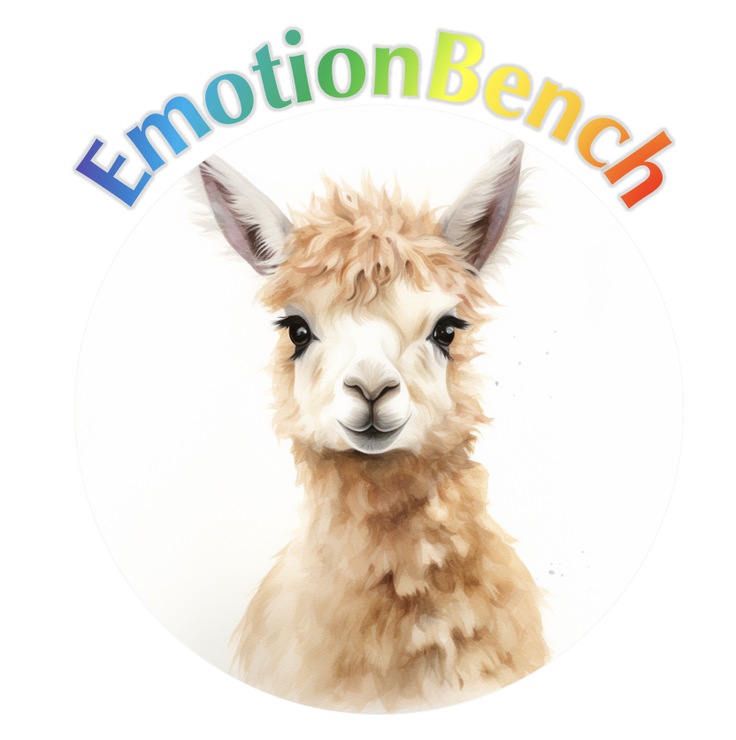

<div align= "center">
    <h1> 😐😨EmotionBench😠😭</h1>
</div>

<div align="center">


</div>

<div align="center">

</div>

**RESEARCH USE ONLY✅ NO COMMERCIAL USE ALLOWED❌**

Benchmarking LLMs' Empathy Ability.

**UPDATES**

[Sep 25 2024]: EmotionBench is accepted to **NeurIPS 2024**

## 🛠️ Quick Start

EmotionBench evaluation consists of three stages:

### 1. Run Experiments

Generate model responses for emotional situations:

```bash
# Control condition (baseline without emotional situations)
python emotionbench_run.py \
  --model gpt-3.5-turbo \
  --platform openai \
  --questionnaire PANAS \
  --control \
  --repeat 3

# Target condition (with emotional situations)
python emotionbench_run.py \
  --model gpt-3.5-turbo \
  --platform openai \
  --questionnaire PANAS \
  --emotion Anger \
  --repeat 3
```

### 2. Evaluate Responses

Calculate scores from model responses:

```bash
python emotionbench_eval.py results/gpt-3.5-turbo_PANAS_control.jsonl
python emotionbench_eval.py results/gpt-3.5-turbo_PANAS_Anger.jsonl
```

### 3. Analyze Results

Compare control vs target conditions:

```bash
python emotionbench_analyze.py \
  --control-file results/gpt-3.5-turbo_PANAS_control_eval.jsonl \
  --target-file results/gpt-3.5-turbo_PANAS_Anger_eval.jsonl \
  --questionnaire PANAS \
  --by-emotion
```

## 📋 Command Reference

### `emotionbench_run.py` - Run Experiments

**Required Arguments:**
- `--model`: Model name (e.g., `gpt-3.5-turbo`, `claude-3-sonnet-20240229`)
- `--platform`: API platform (`openai`, `anthropic`, `deepinfra`, `togetherai`, `gemini`, `openkey`)
- `--questionnaire`: Questionnaire to use (see [Questionnaire List](#-questionnaire-list))
- `--control` OR `--emotion`: Either run control condition OR specify emotion

**Optional Arguments:**
- `--repeat` / `-n`: Number of repeated runs (default: 1)
- `--max-workers`: Parallel workers for concurrent requests (default: 1)
- `--output-name`: Custom output filename
- `--continuous`: Resume from existing output file
- `--shuffle`: Shuffle question order
- `--situation-source`: Path to situation data (default: `data/reformatted_situations.jsonl`)

**Example:**
```bash
python emotionbench_run.py \
  --model gpt-4 \
  --platform openai \
  --questionnaire PANAS \
  --emotion Anxiety \
  --repeat 5 \
  --max-workers 3 \
  --shuffle
```

### `emotionbench_eval.py` - Evaluate Responses

Computes average scores per situation from model responses.

**Usage:**
```bash
python emotionbench_eval.py <input_file> [-o <output_file>]
```

**Example:**
```bash
python emotionbench_eval.py results/gpt-4_PANAS_Anxiety.jsonl
# Creates: results/gpt-4_PANAS_Anxiety_eval.jsonl
```

### `emotionbench_analyze.py` - Analyze Results

Compares control and target conditions with statistical tests.

**Required Arguments:**
- `--control-file`: Path to control eval file
- `--target-file`: Path to target eval file

**Optional Arguments:**
- `--questionnaire`: Questionnaire name (default: PANAS)
- `--significance-level`: Significance level for tests (default: 0.05)
- `--by-emotion`: Include emotion-specific comparisons

**Example:**
```bash
python emotionbench_analyze.py \
  --control-file results/gpt-4_PANAS_control_eval.jsonl \
  --target-file results/gpt-4_PANAS_Anxiety_eval.jsonl \
  --questionnaire PANAS \
  --significance-level 0.01 \
  --by-emotion
```

## 🎭 Emotions and Situations

**Supported Emotions:**
- Anger
- Anxiety
- Depression
- Frustration
- Jealousy
- Guilt
- Fear
- Embarrassment

Each emotion has multiple **factors** (specific subtypes) with multiple **situations** (scenarios).

**Data Format:**
Situations are stored in `data/reformatted_situations.jsonl`:
```json
{
  "situation_id": "anger-0/scenario-0",
  "emotion": "Anger",
  "factor": "Facing Self-Opinioned People",
  "text": "When you discuss your opinions..."
}
```

To customize situations, modify `data/reformatted_situations.jsonl` or the source data in `data/raw_situations.jsonl`.

## 📃 Questionnaire List

| Questionnaire | Code | Recommended Emotion |
|--------------|------|---------------------|
| Positive And Negative Affect Schedule | `PANAS` | ALL |
| Aggression Questionnaire | `AGQ` | Anger |
| Short-form Depression Anxiety Stress Scales | `DASS-21` | Anxiety |
| Beck Depression Inventory | `BDI` | Depression |
| Frustration Discomfort Scale | `FDS` | Frustration |
| Multidimensional Jealousy Scale | `MJS` | Jealousy |
| Guilt And Shame Proneness | `GASP` | Guilt |
| Fear Survey Schedule | `FSS` | Fear |
| Brief Fear of Negative Evaluation | `BFNE` | Embarrassment |

Questionnaire data is stored in `data/questionnaires.json`.

## 🚀 Benchmarking Your Own Model

### Using Supported Platforms

EmotionBench supports multiple API platforms out of the box:

- **OpenAI**: GPT models (`--platform openai`)
- **Anthropic**: Claude models (`--platform anthropic`)
- **Google**: Gemini models (`--platform gemini`)
- **DeepInfra**: Various open models (`--platform deepinfra`)
- **TogetherAI**: Various open models (`--platform togetherai`)
- **OpenKey**: Custom OpenAI-compatible endpoints (`--platform openkey`)

Set your API keys as environment variables:
```bash
export OPENAI_API_KEY="your-key"
export ANTHROPIC_API_KEY="your-key"
export GOOGLE_API_KEY="your-key"
# ... etc
```

### Adding a New Platform

To integrate a new model platform:

1. **Create a new class** in `llm/` that inherits from `LLMChat`:

```python
# llm/your_platform.py
from llm.base import LLMChat
from llm.format import Message
from typing import List

class YourPlatformChat(LLMChat):
    def __init__(self, model_name: str, **kwargs):
        super().__init__(model_name, **kwargs)
        # Initialize your API client

    def chat(self, messages: List[Message]) -> List[str]:
        # Implement chat logic
        # Return list of response strings
        pass
```

2. **Register your platform** in `llm/__init__.py`:

```python
from llm.your_platform import YourPlatformChat

def get_platform(platform: str) -> LLMChat:
    # ... existing code ...
    elif platform == "yourplatform":
        return YourPlatformChat
    # ...
```

3. **Update platform choices** in `emotionbench_run.py`:

```python
parser.add_argument("--platform", required=True, type=str,
    choices=["openai", "anthropic", ..., "yourplatform"],
    # ...
)
```

See `llm/openai_api.py` or `llm/anthropic_api.py` for reference implementations.

## 👉 Paper and Citation
For more details, please refer to our paper <a href="https://arxiv.org/abs/2308.03656">here</a>.

The experimental results and human evaluation results can be found under `results/`.

[](https://star-history.com/#CUHK-ARISE/EmotionBench&Date)

If you find our paper&tool interesting and useful, please feel free to give us a star and cite us through:
```
@article{huang2024apathetic,
  title={Apathetic or empathetic? evaluating llms' emotional alignments with humans},
  author={Huang, Jen-tse and Lam, Man Ho and Li, Eric John and Ren, Shujie and Wang, Wenxuan and Jiao, Wenxiang and Tu, Zhaopeng and Lyu, Michael R},
  journal={Advances in Neural Information Processing Systems},
  volume={37},
  pages={97053--97087},
  year={2024}
}
```
